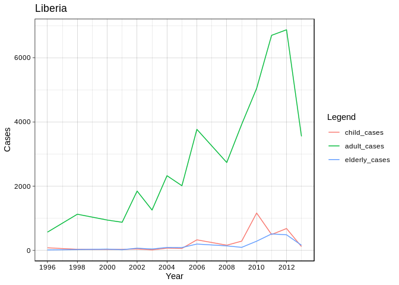
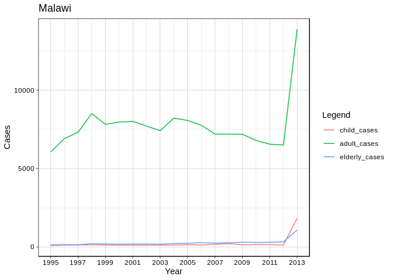
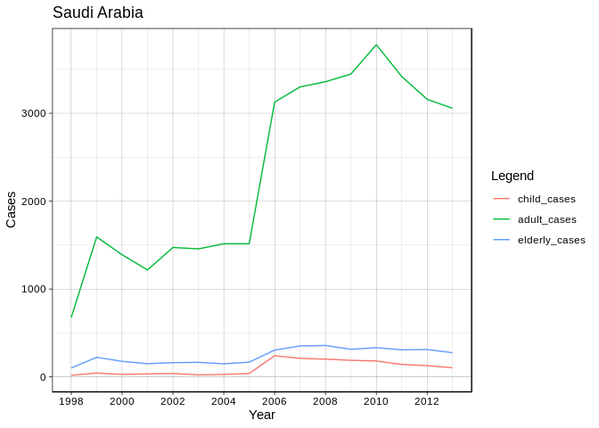

### Libraries

```r
library(dplyr)
library(knitr)
library(ggplot2)
library(reshape2)
library(EDAWR)
```

### Read data

```r
df <- tb
```

### Data summary


```r
kable(summary(df))
```


|   |  country        |     year    |    sex          |    child       |    adult      |   elderly       |
|:--|:----------------|:------------|:----------------|:---------------|:--------------|:----------------|
|   |Length:3800      |Min.   :1995 |Length:3800      |Min.   :    0.0 |Min.   :     0 |Min.   :     0.0 |
|   |Class :character |1st Qu.:1999 |Class :character |1st Qu.:   25.0 |1st Qu.:  1128 |1st Qu.:    84.5 |
|   |Mode  :character |Median :2004 |Mode  :character |Median :   76.0 |Median :  2589 |Median :   230.0 |
|   |NA               |Mean   :2004 |NA               |Mean   :  493.2 |Mean   : 10864 |Mean   :  1253.0 |
|   |NA               |3rd Qu.:2009 |NA               |3rd Qu.:  264.5 |3rd Qu.:  6706 |3rd Qu.:   640.0 |
|   |NA               |Max.   :2013 |NA               |Max.   :25661.0 |Max.   :731540 |Max.   :125991.0 |
|   |NA               |NA           |NA               |NA's   :396     |NA's   :413    |NA's   :413      |

### Tuberculosis cases grouped by gender


```r
group_by_sex_summary <- df %>%
    filter(!is.na(child) & !is.na(adult) & !is.na(elderly)) %>%
    mutate(all=child + adult + elderly) %>%
    group_by(sex) %>%
    summarise(cases = sum(all)) 

kable(group_by_sex_summary)
```


|sex    |    cases|
|:------|--------:|
|female | 15610599|
|male   | 27016456|

### Tuberculosis cases grouped by age


```r
gruped_by_age_and_year <- df %>%
    filter(!is.na(child) & !is.na(adult) & !is.na(elderly)) %>%
    group_by(year) %>%
    summarise(child_cases = sum(child) / 1000, adult_cases = sum(adult) / 1000, elderly_cases = sum(elderly) / 1000)

 d <- melt(gruped_by_age_and_year, id.vars="year")
 
ggplot(d, aes(year,value, col=variable)) + 
    geom_line() +
    labs(x = "Year", y = "Cases [thousands]", color = "Legend") +
    theme_linedraw() +
    scale_x_continuous(breaks = seq(min(d$year), max(d$year), by = 2))
```

<!-- -->

### Tuberculosis cases grouped by age and country


```r
single_graph <- function(df, group) {
  melted <- melt(df, id.vars="year")
  
  print(ggplot(melted, aes(year,value, col=variable)) + 
    geom_line() +
    labs(x = "Year", y = "Cases", color = "Legend") +
    ggtitle(group$country[1]) +
    theme_linedraw() +
    scale_x_continuous(breaks = seq(min(df$year), max(df$year), by = 2))
  )
}
```


```r
grouped_by_age_country_year <- df %>%
    filter(!is.na(child) & !is.na(adult) & !is.na(elderly)) %>%
    group_by(country, year) %>%
    summarise(child_cases = sum(child), adult_cases = sum(adult), elderly_cases = sum(elderly)) %>%
    group_by(country) 

    invisible(group_map(grouped_by_age_country_year,single_graph))
```

<!-- --><!-- --><!-- --><!-- --><!-- --><!-- --><!-- --><!-- --><!-- --><!-- --><!-- --><!-- --><!-- --><!-- --><!-- --><!-- --><!-- --><!-- --><!-- --><!-- --><!-- --><!-- --><!-- --><!-- --><!-- --><!-- --><!-- --><!-- --><!-- --><!-- --><!-- --><!-- --><!-- --><!-- --><!-- --><!-- --><!-- --><!-- --><!-- --><!-- --><!-- --><!-- --><!-- --><!-- --><!-- --><!-- --><!-- --><!-- --><!-- --><!-- --><!-- --><!-- --><!-- --><!-- --><!-- --><!-- --><!-- --><!-- --><!-- --><!-- --><!-- --><!-- --><!-- --><!-- --><!-- --><!-- --><!-- --><!-- --><!-- --><!-- --><!-- --><!-- --><!-- --><!-- --><!-- --><!-- --><!-- --><!-- --><!-- --><!-- --><!-- --><!-- --><!-- --><!-- --><!-- --><!-- --><!-- --><!-- --><!-- --><!-- --><!-- --><!-- --><!-- --><!-- --><!-- --><!-- --><!-- --><!-- --><!-- --><!-- -->


